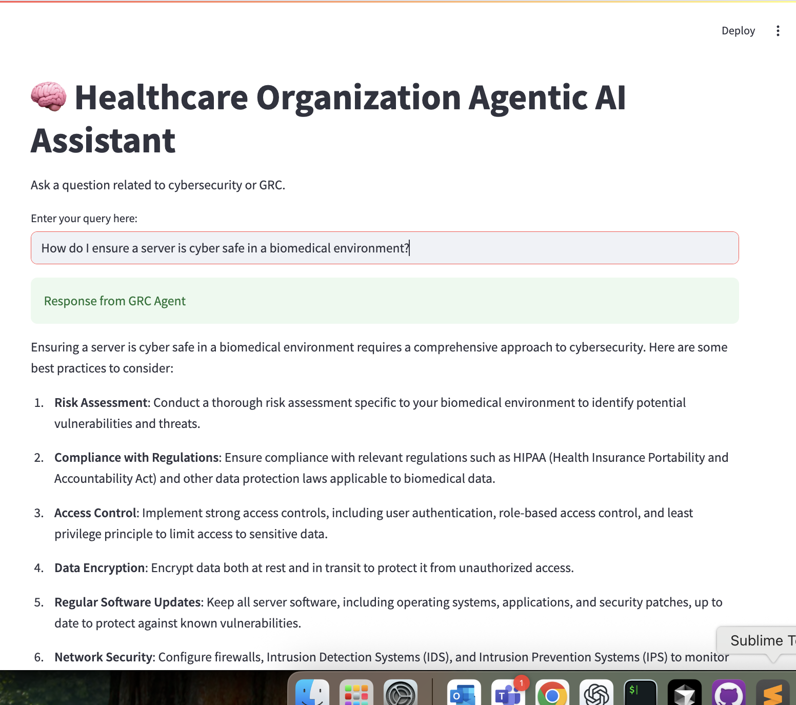

# 🏥 Healthcare Organization Agentic AI System

This is a working prototype of a **multi-agent LLM system** designed to support cybersecurity and governance/risk/compliance (GRC) needs in a healthcare organization.



---

## 🧠 Design Overview

**Purpose**:  
To provide a Streamlit-based front-end for querying Cybersecurity and GRC-focused AI agents that reason over healthcare organization-specific policy, architecture diagrams, and risk inputs.

### 🏗️ Architecture Components
- 🤖 **Cyber Agent**: Ingests threat intel, attack patterns, and internal architecture to offer risk insights.
- 🛡️ **GRC Agent**: Specializes in frameworks like HIPAA, NIST, HITRUST, and healthcare organization internal policies.
- 🔀 **Agent Router**: Directs queries based on keywords or intent to the appropriate agent.
- 📚 **RAG (Retrieval-Augmented Generation)**: All agents use vectorized document embeddings to enrich LLM responses.
- 💻 **Streamlit Front-End**: Matches healthcare organization branding, enables file input, interactive query, and PDF/Word report generation.

---

## 🚀 Project Structure

```
agentic_ai_prototype/
│
├── app/                    # Streamlit application logic
│   ├── main.py
│   └── agent_router.py
│
├── agents/                 # LLM Agents
│   ├── cyber_agent.py
│   ├── grc_agent.py
│   └── shared_tools.py
│
├── config/
│   └── app_config.yaml
│
├── deployment/             # Azure K8s deployment manifests
│   ├── azure_k8s_deployment.yaml
│   └── README.md
│
├── .github/workflows/      # CI/CD pipeline
│   └── deploy.yml
│
├── Dockerfile              # For building the container image
└── README.md               # This file
```

---

## 💻 Local Development Setup

1. **Environment Setup**:
   ```bash
   # Create and activate conda environment
   conda env create -f environment.yml
   conda activate grc-agentic-ai
   
   # Install the package in development mode
   cd agentic_ai_prototype
   pip install -e .
   ```

2. **Configuration**:
   - Create a `.env` file in the project root:
     ```
     OPENAI_API_KEY=your_api_key_here
     ```

3. **Run Locally**:
   ```bash
   streamlit run app/main.py
   ```

---

## ☁️ Azure Production Deployment

### 📝 Prerequisites
- 🟦 Azure subscription
- 📦 Azure Container Registry (ACR)
- ☸️ Azure Kubernetes Service (AKS)
- 🔑 Azure Key Vault

### 🚢 Deployment Steps

1. **Build and Push Container**:
   ```bash
   # Login to Azure
   az login
   
   # Set environment variables
   export ACR_NAME=your-acr-name
   export AKS_NAME=your-aks-name
   export RESOURCE_GROUP=your-resource-group
   
   # Build and push container
   docker build -t $ACR_NAME.azurecr.io/grc-agentic-ai:latest .
   az acr login --name $ACR_NAME
   docker push $ACR_NAME.azurecr.io/grc-agentic-ai:latest
   ```

2. **Deploy to AKS**:
   ```bash
   # Get AKS credentials
   az aks get-credentials --resource-group $RESOURCE_GROUP --name $AKS_NAME
   
   # Create namespace
   kubectl create namespace grc-agentic-ai
   
   # Deploy using manifest
   kubectl apply -f deployment/azure_k8s_deployment.yaml
   ```

3. **Configure Secrets**:
   ```bash
   # Create Kubernetes secret for OpenAI API key
   kubectl create secret generic openai-api-key \
     --from-literal=OPENAI_API_KEY=your_api_key \
     --namespace grc-agentic-ai
   ```

4. **Access the Application**:
   - Get the external IP:
     ```bash
     kubectl get service grc-agentic-ai -n grc-agentic-ai
     ```
   - Access the application at `http://<EXTERNAL_IP>:8501`

### ⚙️ CI/CD Pipeline
The project includes a GitHub Actions workflow (`.github/workflows/deploy.yml`) that automates the deployment process when changes are pushed to the main branch.

---

## 🔒 Security Notes

- 🔑 Use Azure Key Vault or K8s Secrets for managing OpenAI API keys
- 🏥 Follow healthcare organization's internal guidelines for LLM data inputs and logging
- 📜 Ensure all data processing complies with HIPAA requirements
- 🛡️ Implement proper access controls and authentication

---

## 📞 Support

For questions or issues, please contact the Healthcare Organization IT Security Team.
